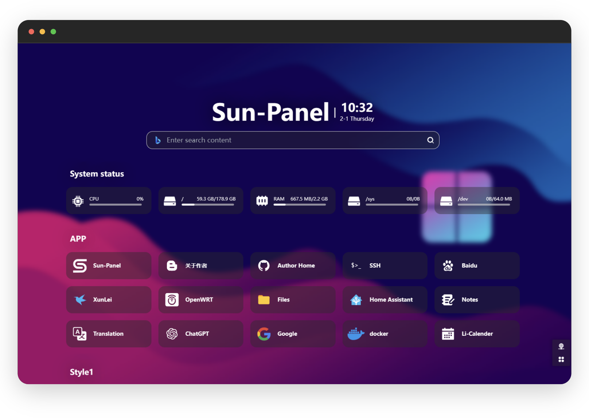
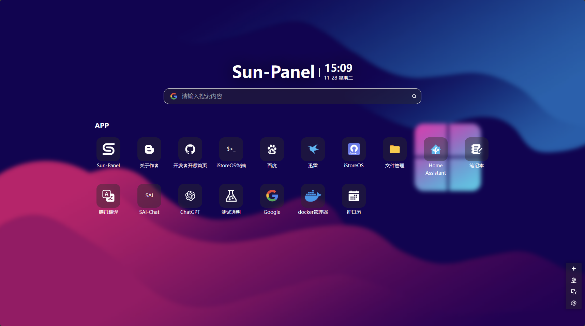
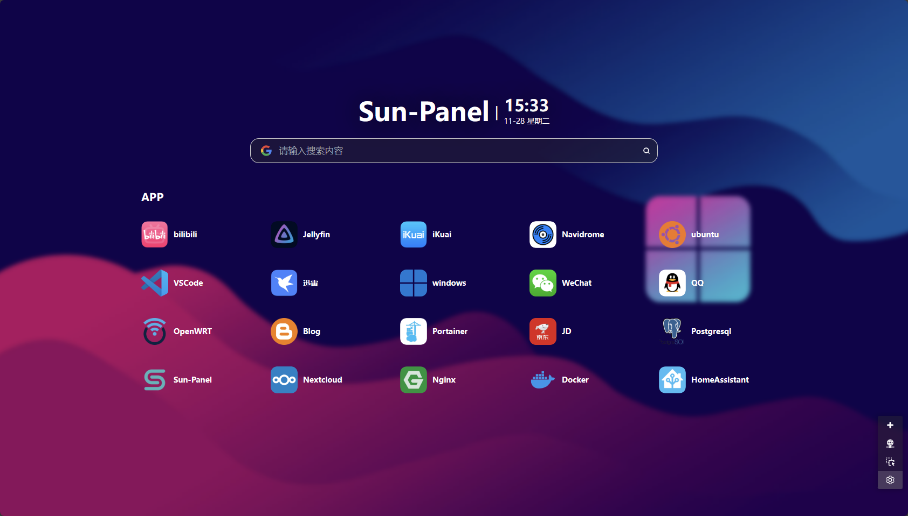
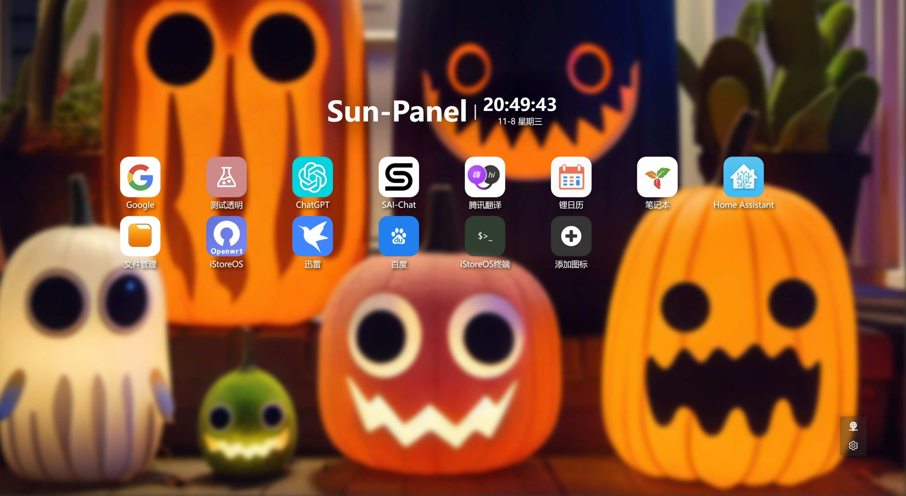
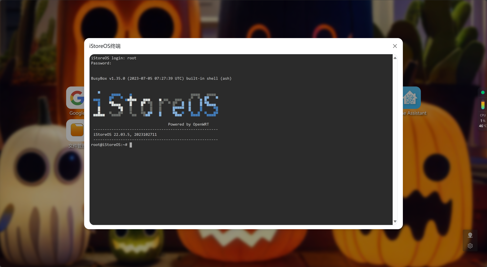

[[ 简体中文 ]](https://sun-panel-doc.enianteam.com/zh_cn/introduce/project.html) |
[[ English ]](https://sun-panel-doc.enianteam.com/introduce/project.html)

<div align=center>


# Sun-Panel

[](https://github.com/hslr-s/sun-panel)
[](https://gitee.com/hslr/sun-panel)
[](https://hub.docker.com/r/hslr/sun-panel) 
[](https://space.bilibili.com/27407696/channel/collectiondetail?sid=2023810)
[](https://www.youtube.com/channel/UCKwbFmKU25R602z6P2fgPYg)
<br>
[](https://github.com/hslr-s/sun-panel)
[](https://github.com/hslr-s/sun-panel/releases)
[](https://hub.docker.com/r/hslr/sun-panel)

[[ 中文文档 ]](https://sun-panel-doc.enianteam.com/zh_cn) |
[[ Document ]](https://sun-panel-doc.enianteam.com) |
[[ Demo ]](http://sunpaneldemo.enianteam.com) 

A server, NAS navigation panel, Homepage, Browser homepage.
<br>
一个服务器、NAS导航面板、Homepage、浏览器首页。

</div>




> [!IMPORTANT]
> In order to maintain the livelihood, the author added some [`PRO`] (https://pro.sun-panel.top) function, so the project temporarily entered a closed source state.; At present, the latest version of the open source is `v1.3.0`, [Please see the latest version of closed source](https://github.com/hslr-s/sun-panel/releases).; When the modular technology is developed, the separation of the PRO and the programs will be opened again, and the closed source will have no effect on ordinary users.; Let's look forward to open source again, and at the same time, we are welcome to supervise and review the security of the program.
> 
> 作者为了维持生计，增加了一些 [`PRO`](https://pro.sun-panel.top) 功能，所以项目暂时进入闭源状态。目前开源最新版本为`v1.3.0`，[闭源最新版本请查看](https://github.com/hslr-s/sun-panel/releases)。待开发出模块化技术，然后对PRO和主程序进行分离会再次开源，闭源对普通用户没有任何影响。我们一起期待再次开源吧，同时也欢迎各位大佬对程序的安全性进行监督和审查。

## 😎 Features

- 🍉 Clean interface, powerful functionality, low resource consumption
- 🍊 Easy to use, visual operation, zero-code usage
- 🍠 One-click switch between internal and external network modes
- 🍵 Supports Docker deployment (compatible with Arm systems)
- 🎪 Supports multi-account isolation
- 🎏 Supports viewing system status
- 🫙 Supports custom JS, CSS
- 🍻 Simple usage without the need to connect to an external database
- 🍾 Rich icon styles for free combination, supports [Iconify icon library](https://icon-sets.iconify.design/)
- 🚁 Supports opening small windows in the webpage (some third-party websites may block this feature)

## 🖼️ Preview Screenshots

**Various styles, freely combined**







**Built-in small windows**




## 🐳 Deployment tutorial
[Deployment Tutorial](https://sun-panel-doc.enianteam.com/usage/quick_deploy.html)

## Python Backend

This repository now also includes a self-contained Python backend rewrite in `service_python/`.

From the repo root:

```bash
pnpm install
pnpm run backend:python:build-runtime
pnpm run backend:python:run
```

Python backend tests:

```bash
pnpm run backend:python:test
```

Optional Go parity comparison:

```bash
SUN_PANEL_ENABLE_GO_PARITY=1 pnpm run backend:python:test
```

Docker deployment for the Python backend:

```bash
docker compose -f docker-compose.python.yml up --build -d
```

## 🍵 Donate

> Open-source development is not easy. If you feel that my project has helped you, you are welcome to [donate](./doc/donate.md) or buy me a cup of tea☕ (please leave your nickname or name in the note if possible). Your support is my motivation, thank you.


<a href="https://www.paypal.me/hslrs">
</img> 
</a>


|   |   |
| ------------ | ------------ |
|  |   |

## 🏖️ Communication group & community

Author：**[红烧猎人](https://blog.enianteam.com/u/sun/content/11)**

[Github Discussions](https://github.com/hslr-s/sun-panel/discussions)

QQ交流群，进不去可以点上方连接联系作者


## ❤️ Thanks

- [Roc](https://github.com/RocCheng)
- [jackloves111](https://github.com/jackloves111)
- [Rock.L](https://github.com/gitlyp)


---

[](https://star-history.com/#hslr-s/sun-panel&Date)
